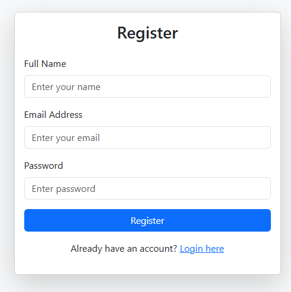

# Test_1
## Test
### Testing subsection

<p align="center">
  
</p>

<h1>Demo Page</h1>

<p align="center">A web app for user auth and other pages</p>

<p align="center">
  
</p>

# 🛠Technology
- **Frontend** : HTML, CSS, Bootstrap 5
- **Logic** : JS

<details>
  <summary>Click to view installation</summary>
  ```bash
  git clone url
  cd project
  npm install
  npm start
  ```
</details>

# 📷 Screenshots
<p align="center">
  
  
</p>

# ScreenShots


